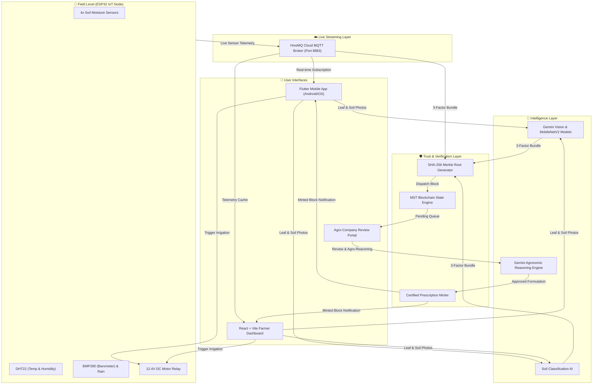

<div align="center">

# 🌾 KrishiAI — Smart Agriculture Decision Engine & Blockchain Ecosystem
### *Smarter Farms, Brighter Tomorrows*

[](https://flutter.dev)
[](https://vitejs.dev)
[](https://nodejs.org)
[](https://www.hivemq.com)
[](https://deepmind.google/technologies/gemini/)
[](https://github.com/gogulgupta/Krishi_AI)

<p align="center">
  <b>An end-to-end intelligent precision farming ecosystem integrating real-time ESP32 IoT sensors, Multi-Modal Gemini Vision AI, 3D Soil visualizers, and tamper-proof blockchain verification for farmers and agro-chemical companies.</b>
</p>

---

</div>

## 📌 Overview

Traditional farming faces immense challenges due to unscientific chemical fertilizer application, late detection of crop diseases, inefficient water usage, and lack of verifiable farm data. 

**KrishiAI** bridges this gap by creating an integrated **Decentralized Agronomic Platform** where:
1. **IoT Telemetry** captures live soil moisture across 4 field zones, temperature, humidity, pressure, and rain status.
2. **Computer Vision & Gemini AI** classifies plant diseases and soil types instantly.
3. **Cryptographic SHA-256 Merkle Trees** bundle the 3-factor farm telemetry into an immutable proof.
4. **Agro-Chemical Companies** verify incoming requests on the blockchain and mint scientifically certified prescriptions with dosage, spray windows, and government subsidy calculations.

---

## 🌟 Key Features & Modules

### 1. 📱 Cross-Platform Flutter Mobile Application (`krishi_ai_app`)
- **Native Android & iOS Support** with high-performance rendering.
- **🌐 Dynamic Bilingual UI**: Seamless one-tap instant switching between **Hindi (हिन्दी)** and **English**.
- **📍 Automatic GPS & Network Geolocation**: Auto-detects user district & state with 1-tap live refresh.
- **⚡ Real-Time HiveMQ Cloud MQTT Telemetry**: 1-second live stream of IoT sensor readings and 12.4V pump relay switches.
- **🎨 Rich Animated Splash Screen**: Custom branded launch animations with smooth scale and fade transitions.

---

### 2. 👨‍🌾 3-Factor Farmer Blockchain Hub (`MST Protocol`)
Bundles three independent factors into an immutable cryptographic hash before dispatching to agro-chemical portals:
- **Factor 1 (Leaf Health)**: Plant Disease Diagnostic & Confidence Score.
- **Factor 2 (Live Field State)**: ESP32 4-Zone Soil Moisture + DHT22/BMP280 Climate Sensors.
- **Factor 3 (Soil Profile)**: AI Soil Classification & Organic Nutrient Vector.
- **Cryptographic Merkle Root**: Calculated via SHA-256 leaves (`merkleRoot = sha256(leaf1 + leaf2 + leaf3)`).

---

### 3. 🔬 Multi-Modal AI Plant Disease Detection
- Multi-class plant disease classification.
- High-precision confidence scores with stage-wise diagnostic severity.
- Deep visual explanations and recommended biological/chemical treatments.

---

### 4. 🌱 Soil AI Studio & 3D Interactive Visualizer
- Multi-class soil classification (Alluvial, Black, Clay, Red, Sandy, Loamy).
- 4-Zone real-time color transitions based on live sensor moisture (0% Dry Brown ➔ 50% Mid Brown ➔ 100% Dark Mud).
- Specific crop suitability advisories, NPK nutrient balancing, and anomaly alerts.

---

### 5. 🏢 Fertilizer Company Verification & Minting Portal
- Agro-chemical agronomists review incoming blockchain telemetry leaves.
- Gemini AI generates structured, scientifically balanced fertilizer formulations (e.g. *Azoxystrobin + Difenoconazole SC*).
- Calculates exact spray windows (e.g. *06:30 AM - 08:30 AM* based on stomatal opening and wind speed), dosage per acre, and net subsidized price.
- Mints verified prescription blocks directly onto the blockchain for farmer execution.

---

### 6. 💧 Smart Precision Irrigation Engine
- Automated moisture threshold triggers to prevent over-watering and root rot.
- Remote control for 12.4V DC water pump relays with live feedback loop.

---

### 7. 🏛️ Integrated Government Schemes & Direct Portals
Integrated verified direct access to key central & state agriculture schemes:
- **PM-KISAN** (₹6,000/yr Direct Benefit Transfer)
- **PM-KUSUM** (60% Direct Solar Agricultural Pump Subsidy)
- **PMFBY** (Crop Insurance Scheme)
- **Kisan Credit Card (KCC)** (4% subsidized interest rate)
- **Per Drop More Crop (PDMC)** (55%-80% Drip/Sprinkler subsidy)
- **Soil Health Card (SHC)** & **PKVY Organic Farming Clusters**
- **Agriculture Infrastructure Fund (AIF)** (Cold storage & warehouse credit guarantee)

---

## 🏗️ System Architecture & Workflow



---

## 🛠️ Technology Stack

| Layer | Technologies |
|---|---|
| **Mobile Application** | Flutter 3.x, Dart, Cupertino & Material 3, SingleTicker Animation Controllers |
| **Web Frontend** | React.js 18, Vite, TailwindCSS, Lucide Icons, Modern Glassmorphic UI |
| **Backend Server** | Node.js, Express.js, WebSockets, CORS, Dotenv |
| **IoT & Telemetry** | ESP32 Microcontroller, HiveMQ Cloud Secure MQTT (TLS 8883) |
| **Artificial Intelligence** | Google Gemini 3.6 Flash / Pro Multi-Modal API, PyTorch, Keras |
| **Cryptography & Security** | SHA-256 Merkle Trees, Immutable Block Ledger, Zero-Knowledge Telemetry Proofs |

---

## 📂 Repository Structure

```
Krishi_AI/
│
├── krishi_ai_app/               # 📱 Flutter Mobile Application
│   ├── lib/
│   │   └── main.dart            # Complete mobile app logic & UI tabs
│   ├── assets/                  # App branding, logo & graphic assets
│   ├── android/                 # Android native project & manifest
│   ├── ios/                     # iOS native project
│   └── pubspec.yaml             # Flutter dependencies & assets config
│
├── krishiAi-main/               # 🌐 Web Application & Backend
│   ├── backend/                 # Node.js Express server & blockchain service
│   │   ├── routes/              # API endpoints (/prediction, /blockchain)
│   │   ├── services/            # MQTT & AI integration services
│   │   └── server.js            # Backend entry point
│   ├── src/                     # React Frontend
│   │   ├── components/tabs/     # Dashboard, FarmerHub, SoilStudio, CompanyPortal, etc.
│   │   └── services/            # Client-side API & telemetry services
│   └── package.json             # Frontend dependencies
│
├── main.dart                    # 📄 Root Flutter Application Architecture
├── run.txt                      # 📜 Step-by-step service startup guide
├── .gitignore                   # 🚫 Git ignore rules (filters ML models & temp builds)
└── README.md                    # 📖 Project Documentation
```

---

## 🚀 Quick Start Guide

### Prerequisites
- [Flutter SDK](https://flutter.dev/docs/get-started/install) (v3.19+)
- [Node.js](https://nodejs.org/) (v18+)
- [Git](https://git-scm.com/)

---

### 1️⃣ Run the Mobile Application (Flutter)
```bash
# Navigate to the Flutter app directory
cd krishi_ai_app

# Fetch dependencies
flutter pub get

# Run on connected Android device / Emulator
flutter run
```

---

### 2️⃣ Run the Backend Server
```bash
# Navigate to backend directory
cd krishiAi-main/backend

# Install dependencies
npm install

# Start backend server on Port 5003
npm start
```

---

### 3️⃣ Run the Web Frontend (Vite)
```bash
# Navigate to web directory
cd krishiAi-main

# Install dependencies
npm install

# Start Vite dev server on Port 5173
npm run dev
```

---

## 🌐 Service Port Mapping

| Service | Port | Description |
|---|---|---|
| **Web Dashboard** | `http://localhost:5173` | React / Vite Frontend User Interface |
| **Backend API** | `http://localhost:5003` | Blockchain Engine & Telemetry Aggregator |
| **Soil Model API** | `http://localhost:8501` | Soil Classification Streamlit Engine |
| **Disease Model API** | `http://localhost:8502` | Plant Disease Detection Streamlit Engine |
| **HiveMQ MQTT** | `tls://...hivemq.cloud:8883` | Secure IoT Telemetry Broker |

---

## 🔒 Security & Privacy
- **Client-Side Abstraction**: API keys are securely decoupled via environment variables.
- **Tamper-Proof Farming**: Sensor logs are cryptographically verifiable on the MST blockchain, preventing fraudulent fertilizer subsidy claims.
- **Privacy First**: Sensitive geolocation is processed on-device with opt-in GPS refresh.

---

## 📜 License
This project is licensed under the **MIT License**.

---

<div align="center">
  <b>Developed with ❤️ for Indian Farmers by Gogul Gupta</b><br>
  <i>Empowering Agriculture through Intelligent Technologies</i>
</div>
